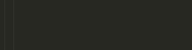

console.log-snippet
===================

> log -> console.log() | Sublime text snippet



### How to use it?

* write `log` in .js files or inside `<script>` tag and press tab key
* `log` will be replaced with `console.log();` 

### Installation

* put the `log.sublime-snippet` file into Sublime Text user settings folder

Windows

```
c:/Users/*username*/AppData/Roaming/Sublime Text 3/Packages/User
```

### Related

* [Console wrap](https://github.com/unknownuser88/consolewrap) plugin plays very nicely with this snippet 